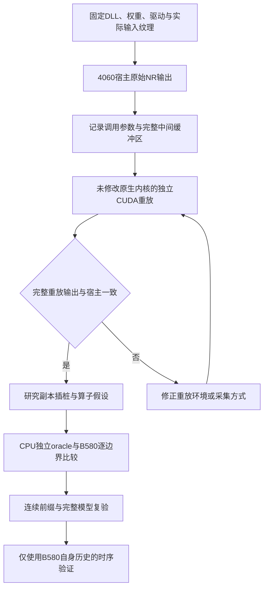

# 从不完整计算图到精确后端

## 要恢复的是实际计算

“能加载全部权重”“张量尺寸正确”和“输出有限”都不足以证明 NR 恢复成功。最初使用社区 `DLSS5Graph` 加载153条记录、71个块，权重映射没有 skipped，仍得到明显错误的图像。三份256测试中，候选相对4060输出的RGB平均绝对误差约1.65，远大于原生NR对输入图像约0.004–0.016的变化。没有通过裁剪输出到[0,1]掩盖这件事。

社区项目提供了有价值的解析器、布局线索和研究工具，但它明确区分原生执行、不完整语义图和蒸馏近似模型。本项目使用固定运行库提取的原权重恢复计算，没有把其中的 PortableModel 当作原 NR。

## 逐层建立可信起点

采用以下顺序，每一步先解决参考可信度，再解决 B580 计算：

独立重放并不是迁移结果。它回答的是：是否真正掌握了原生调用的输入、内存布局、纹理属性和参数？若重放本身不对，用它推导 B580 算法就会建立在错误参考上。

## 从 pre 开始，不从最终画面猜

先隔离首个 pre 内核。输入256×256，实际内部padding320×320，原生产生 skip 和 down 两个缓冲区。使用原始 CUBIN 重放，两份完整输出分别3,276,800和819,200字节，与宿主捕获完全相同。

随后把 pre 拆成front特征、投影、MLP、QKV、Q/K归一化、分数与指数、行归一化、加权V、输出投影、skip/down。每个边界使用相同输入比较整个输出，不只抽查几个像素。

最初允许原生front作为隔离测试的输入，从而把噪声实现错误和网络主体错误分开。此时只声明“给定原生front的pre主体正确”。后面恢复完整噪声标量域后，才把门槛升级为原始RGB输入到最终RGB输出的独立计算。

## 用连续前缀阻止局部正确掩盖全局错误

pre之后是4个C32、4个C64、6个C128、8个C256、8个C512、8个ViT及解码器/post。不是每个块都接一份原生输入然后分别宣称整网成功，而是把B580上一块的实际输出送入下一块。

| 历史里程碑 | 明确起点 | 比较范围 | 结果的边界 |
| --- | --- | --- | --- |
| pre主体 | 同一原生front | 4素材×CPU/B580×skip/down | 尚不覆盖独立front |
| 编码器至C512 | 同一原生front | 4素材×2设备×62完整缓冲区=496比较 | 尚不覆盖ViT、post |
| 编码器与ViT | 同一原生front | 4素材×2设备×120缓冲区=960比较 | 尚不覆盖最终RGB |
| 完整网络主体 | 同一原生front | 4素材×2设备×176缓冲区=1408比较 | 独立front另验 |
| 首批独立RGB执行 | 原始RGB、种子与固定资产 | 6份256输入最终RGB | 仍只是记录的reset场景 |

这些数量描述历史源码下的比较，不是当前源码的回归数量，也不是互不重叠的独立场景数。原报告身份见[证据索引](../evidence/index.json)。

## 扩尺寸时重新寻找第一个分歧

256和512通过不代表1080p也正确。1080p中某个解码器C128块仍有73个FP8字节不同。我们确认前一个调用输出一致，再向该块内部细分：MLP全部正确，QKV全部正确，归一化K只有一个值不同，指数传播后出现更多差异。

这最终定位到 half FMA 的中点舍入，而不是对失败窗口或最终图像打补丁。修正的是通用算术函数，再用独立整数oracle、其他输入和完整图验证。详细数值案例见[数值规则](03-numerics-and-layouts.md)。

## 把错误实验也记录下来

曾遇到插桩太早读取Tensor Core输出，读到旧寄存器；选错注意力寄存器块；用错down布局；XPU再次编码FP8丢失负零；抽帧保留非零时间戳导致重复首帧。这些问题有的在模型，有的在测量工具。实验版本和失败收据保留，不通过覆盖旧JSON把失败改成成功。

最值得复用的方法是：固定参考、证明测量链正确、定位第一个不同的边界、提出可被否定的数值/布局假设、用独立输入验证，然后重新连接完整计算链。最终画面相似只能作为视觉指标，不能替代这套证据。
